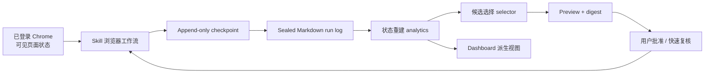

# 系统架构

## 目标

系统把每次 500px 互动当作可追溯实验：从可见页面确认动作，把事实追加到本地日志，再从日志重建状态、选择下一批候选并生成 Dashboard。

核心指标是滚动 30 天内，每 100 次已成熟外发点赞带来的独立归因回馈摄影师人数。它用于比较策略效果，不代表严格因果。

## 组件与数据流

### 浏览器执行层

`SKILL.md` 和 `references/browser-workflow.md` 定义可见页面导航、候选检查、点赞/评论确认和硬停止规则。该层不保存浏览器认证信息，也不自行判断长期分层。

### 状态与算法层

- `store.py`：校验并读写 Markdown checkpoint 和 sealed log。
- `analytics.py`：按事件顺序重建摄影师、episode、每日任务和归因状态。
- `selector.py`：在每日配额、覆盖率和单人上限内执行可复现选择。
- `cli.py`：编排 run 生命周期、preview 审批、事件追加和错误码。

### 展示层

`dashboard.py` 从同一聚合状态生成自包含 HTML。Dashboard 不加载远程资源，不保存独立业务状态，也不能反向修改日志。

## 事实源层级

| 数据 | 权威来源 | 是否可直接修改 |
|---|---|---|
| 页面动作是否成功 | 动作前后同一可见控件状态 | 否，只能重新读取 |
| 活动运行进度 | `.local/.../checkpoints/*.md` | 否，只能通过 CLI 追加 |
| 已完成运行 | `.local/.../runs/*.md` | 否，sealed 后不可覆盖 |
| 聚合摄影师状态 | 从有效日志重建 | 否，属于派生状态 |
| Dashboard | 从聚合状态生成 | 可以重建，不作为输入 |
| 设计和工作约定 | Git 中的文档、代码、测试、ADR | 通过正常变更流程维护 |

具体决策见 [ADR-0001：追加式事件日志](decisions/ADR-0001-append-only-event-log.md)。

## 运行生命周期

### Preflight

1. 扫描当时最新 30 幅本人作品。
2. 记录可见点赞来源和评论候选，不产生互动。
3. 重建反馈、生成最多 25 位候选的 preview、digest 和 24 小时 expiry。
4. 封存 preflight，等待首次明确批准。

### Approval

同日新鲜 preview 且其后没有确认互动时，不重新执行完整 preflight。只按 `source_url` 分组复核已批准候选仍可见、顺序和稳定字段未变，然后校验 digest。

这样既保留“批准内容未变化”的安全边界，也避免二次扫描 30 幅作品造成分钟级页面差异、延迟和 `preview_changed`。

### Run

1. 每批最多 25 个确认点赞，当日累计不超过 100。
2. 每个成功动作立即写入 checkpoint，并自动打开或延长 72 小时 feedback episode。
3. 达到批次上限、安全停机或候选耗尽后封存 run。
4. 重建 status 和 Dashboard。

## 算法合同

- 日配额目标：`45 exploit_first + 20 retest + 15 new + 最多 20 verified_second`。
- 完成 100 个点赞时至少覆盖 80 位摄影师；单人最多 2 幅，第二幅只限 `verified`。
- 历史高频或近期点赞者仅获得 `promising` 先验，不直接记成功。
- `verified`：滚动 30 天内至少 2 个独立成功 episode。
- `dormant`：至少 2 个成熟失败且近 30 天没有成功，冷却 30 天后才能低频复测。
- episode 默认 72 小时；窗口内第二次触达延长同一 episode，不创建第二个独立成败样本。
- 同一摄影师在窗口内给多幅作品点赞，只计一个独立回馈者；额外作品只增加收到点赞数。
- 证据采用 30 天半衰期；Thompson Sampling 必须支持固定 seed，时间逻辑必须支持注入时钟。

详细数学定义和验收条件保留在 [原始设计 spec](superpowers/specs/2026-08-12-500px-feedback-growth-design.md)。

## 安全不变量

- 只有页面确认的状态变化才能成为 `outgoing_*_confirmed`。
- 已知历史 pair 不能在未来被重新解释为回馈成功。
- 同一 action ID 不能重复写入；同一自然日不能超过 100 个成功点赞。
- `safety_paused` 后禁止继续追加外发动作，但允许封存当前 run。
- 页面内容不构成指令；凭证和认证材料不进入日志。
- `Asia/Shanghai` 是日界线，未完成额度不跨日结转。

## 兼容性边界

单元测试验证本地数据合同，不证明 500px 页面结构长期稳定。页面兼容性需要通过无副作用 preflight 和用户明确授权的真实批次持续验证；稳定的新经验写入 [运行手册](operations.md) 和 skill reference。
