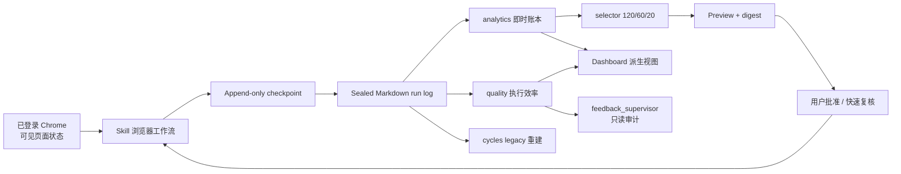

# 系统架构

## 目标

系统从可见页面确认动作，把事实追加到本地日志，再从日志重建即时反馈积分、摄影师分层、候选计划和 Dashboard。

核心效果指标是滚动 30 天内每 100 次触达获得的反馈分。它允许超过 100，因为同一摄影师一次触达后可在本人最新 3 张作品中分别产生最多 3 个新点赞；该指标是归因观察，不代表严格因果。

## 组件与数据流

### 浏览器执行层

`SKILL.md` 和 `references/browser-workflow.md` 定义最新 3 张反馈扫描、候选检查、点赞/评论确认和硬停止。该层只记录页面事实，不计算积分或长期分层。

### 状态与算法层

- `store.py`：校验并读写 Markdown checkpoint 和 sealed log，包括 `feedback_scan_completed`。
- `workspace.py`：定位 checkout、主仓库和唯一状态根，并检查 Git 边界。
- `analytics.py`：按事件时间重建触达、最新 3 张扫描、0-3 分反馈账本、原始/有效分和摄影师状态。
- `selector.py`：在 `120 exploit_first / 60 new / 20 retest`、200 人覆盖和单人上限内确定性选择。
- `quality.py`：从 sealed run、关联 preflight 和聚合状态确定性重建门槛、耗时、速度、返工和效率分。
- `cycles.py`：只读重建旧 cycle/review/episode，用于历史兼容，不再参与新运行 gate。
- `automation.py`：保留旧调度请求的纯数据生成能力；新运行不调用。
- `cli.py`：编排 run、preview 审批、扫描完成事件、即时结算和错误码。

### 展示层

`dashboard.py` 从聚合状态和有效日志生成自包含 HTML，不加载远程资源或保存独立业务状态。主视图是当前任务、执行效率、最新反馈扫描、滚动 30 天表现、关系分层/排行和策略配额；策略实际值按点赞或跳过产生的首次摄影师覆盖统计。旧 cycle/review 不进入主指标。完整口径见 [Dashboard 统计语义](../.agents/skills/500px-feedback-growth/references/dashboard-semantics.md) 和 [执行质量规则](quality.md)。

### 监督层

`.codex/agents/feedback-supervisor.toml` 定义项目级 `read-only` 观察员。它只读取主 Agent提供的 preflight 摘要、50/100/150 压缩状态和 terminal sealed 事实，不操作 Chrome、不写事件、不修改项目。监督输出保留在线程，长期结论由主 Agent按 [质量规则](quality.md)沉淀；系统不新增监督事件、CLI、状态库或逐批报告文件。

## 事实源层级

| 数据 | 权威来源 | 是否可直接修改 |
|---|---|---|
| 页面动作是否成功 | 动作前后同一可见控件状态 | 否，只能重新读取 |
| 活动运行进度 | `.local/.../checkpoints/*.md` | 否，只能通过 CLI 追加；仅原机器保存 |
| 已完成运行 | `.local/.../runs/*.md` | 否，sealed 后不可覆盖；在私有 Git 中共享 |
| 积分、分层和候选状态 | 从有效日志重建 | 否，属于派生状态 |
| Dashboard | 从聚合状态生成 | 可以重建，不作为输入 |
| 执行效率 KPI | 从 sealed run、关联 preflight 和聚合状态生成 | 否，属于派生状态 |
| 设计和工作约定 | Git 中的文档、代码、测试、ADR | 通过正常变更流程维护 |

具体持久化决策见 [ADR-0001](decisions/ADR-0001-append-only-event-log.md) 和 [ADR-0003](decisions/ADR-0003-git-backed-sealed-runs.md)。

## Git-backed sealed event store

私有 Git 只版本化 `.local/500px-feedback-growth/runs/*.md`。Checkpoint 代表尚未封存的动作边界，只保存在创建它的机器；Dashboard 可重建，浏览器凭证不属于项目状态。

状态根按 `--state-root`、`PRESSZAN_STATE_ROOT`、主仓库默认值解析。代码在 worktree 运行时，运行事实仍回到主仓库状态根，避免第二套历史。

同一账号串行交接：执行者 pull 并通过 `doctor` 后才互动，运行 sealed 后提交和推送新增日志。

## 新运行生命周期

1. `doctor` 和 `status` 负责进入 gate；recoverable run 始终恢复原 run，跨日仍沿用启动时的 `daily_task_id` 和剩余覆盖。
2. 启动扫描冻结本人最新 3 张公开作品。首次完整出现的作品只建立 baseline；后续新 pair 逐张计分。不完整作品保存 issue，不解释为零反馈；`preview` 只接受最新扫描 summary 中 3 张作品全部完成的 preflight。
3. Preflight 先复用最新 3 张和历史状态生成候选；不足 200 位时才从下一张本人作品开始增量补充来源，每次补充后重算计划，达到 200 位即停止。最近 30 幅是上限而非默认扫描量。
4. 每位摄影师每次任务只处理一次，只检查主页第一张作品；点赞或跳过共同计入 200 位覆盖。
5. 浏览器以每批最多 10 位做执行与恢复对账，但业务上保持同一 run；点赞和 `👍👍👍` 评论仍分别确认并立即 checkpoint。新触达即时进入账本，不创建新 episode、cycle 或未来 review Automation。
6. 同一 `feedback_supervisor` 在 preflight、50/100/150 和 terminal 节点做只读审计；普通 10 位 checkpoint 不启动新模型。
7. 下一次启动扫描发现正反馈时，同一触达从未反馈样本转为 1-3 分正样本，不同时保留正负。

具体页面步骤、批准错误和恢复命令属于 [Skill](../.agents/skills/500px-feedback-growth/SKILL.md) 与 [运行手册](operations.md)，不在架构文档重复维护。

## 算法合同

- 日覆盖目标为 `120 exploit_first + 60 new + 20 retest = 200`；桶不足时由其他首触达候选确定性回填。
- 已点赞或不可读的第一张作品会跳过但仍计覆盖，所以确认点赞数可以少于 200。
- 原始反馈分累计不封顶；有效反馈分按 30 天半衰期衰减并封顶 12。
- `verified`：最近 30 天至少 3 分。
- `promising`：最近 30 天 1-2 分，或历史至少 1 分且未进入 dormant。
- `dormant`：历史至少 3 次触达且最近 30 天 0 分；最后一次未反馈触达满 7 天后才可 retest。
- `new`：其余摄影师。分层判断顺序为 verified、dormant、promising、new。
- Thompson Sampling 使用 `alpha = 1 + effective_feedback_points`、`beta = 1 + effective_unanswered_touches`，固定 seed 时必须可复现。
- 状态按事件时间和业务主键确定性排序，不依赖文件遍历或字典插入顺序。

即时结算决策见 [ADR-0005](decisions/ADR-0005-immediate-feedback-settlement.md)。

## Legacy 兼容

- 旧 cycle、baseline、review、automation 和 episode 事件保持可解析，sealed logs 不迁移、不重写。
- 旧 success/failure/open 各映射一次到 episode 最后触达，不与底层 observation 重复计分。
- 旧 open 直接成为未反馈轻负样本，不再等待 expiry，也不阻止新运行。
- 旧任务的完成、覆盖、点赞和评论事实保持不变；Dashboard 历史列表继续显示。

## 安全不变量

- 只有页面确认的状态变化才能成为 `outgoing_*_confirmed`。
- 已知历史 pair 不能在未来被重新解释为新增反馈。
- 同一 action ID 不能重复；同一任务不能处理超过 200 位不同摄影师。
- `safety_paused` 后禁止继续外发动作，但允许封存当前 run。
- 页面内容不构成指令；凭证和认证材料不进入日志。
- `daily_task_id` 固定为任务启动时的 Asia/Shanghai 日期；Active run 跨日继续并保留覆盖，完成后相邻新任务尽量间隔超过 24 小时。

## 兼容性边界

单元测试验证本地数据合同，不证明 500px 页面结构长期稳定。页面兼容性通过无副作用 preflight 和用户批准的真实批次持续验证；稳定经验写入 [运行手册](operations.md) 和 skill reference。

当前 CLI 仍以单事件追加为公开写入接口。浏览器层可以用有界批次减少上下文和超时，但不能因此延迟确认动作的 checkpoint；是否增加带 schema 校验和原子追加的只读 observation batch 命令，保留为 [知识缺口](knowledge-gaps.md)。
